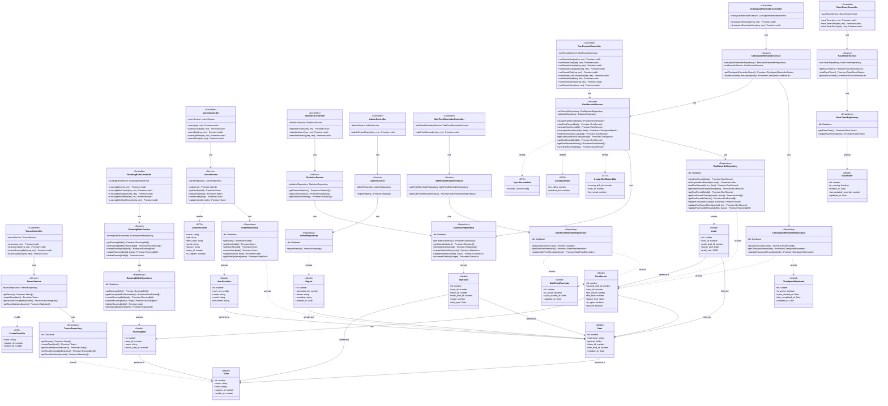

```mermaid
classDiagram

    class UsersController {
        <<Controller>>
        -usersService: UsersService
        +users(req, res) Promise~void~
        +usersCreate(req, res) Promise~void~
        +usersById(req, res) Promise~void~
        +usersUpdate(req, res) Promise~void~
        +usersTeam(req, res) Promise~void~
    }
    class TeamsController {
        <<Controller>>
        -teamsService: TeamsService
        +teams(req, res) Promise~void~
        +teamsCreate(req, res) Promise~void~
        +teamsRunningBelts(req, res) Promise~void~
        +teamsStatistics(req, res) Promise~void~
    }
    class RunningBeltsController {
        <<Controller>>
        -runningBeltsService: RunningBeltsService
        +runningBelts(req, res) Promise~void~
        +runningBeltsCreate(req, res) Promise~void~
        +runningBeltsUpdate(req, res) Promise~void~
        +runningBeltsDelete(req, res) Promise~void~
        +runningBeltsRunRecords(req, res) Promise~void~
    }
    class RunRecordsController {
        <<Controller>>
        -runRecordsService: RunRecordsService
        +runRecordAssign(req, res) Promise~void~
        +runRecordStart(req, res) Promise~void~
        +runRecordActivate(req, res) Promise~void~
        +runRecordCheckpoint(req, res) Promise~void~
        +runRecordEnd(req, res) Promise~void~
        +runRecordLastCheckpoint(req, res) Promise~void~
        +runRecordById(req, res) Promise~void~
        +runRecordsHistory(req, res) Promise~void~
        +runRecordsSync(req, res) Promise~void~
    }
    class StatisticsController {
        <<Controller>>
        -statisticsService: StatisticsService
        +statisticsTeams(req, res) Promise~void~
        +statisticsUsers(req, res) Promise~void~
        +statisticsRanking(req, res) Promise~void~
    }
    class AdminController {
        <<Controller>>
        -adminService: AdminService
        +adminExportReport(req, res) Promise~void~
    }
    class CheckpointReminderController {
        <<Controller>>
        -checkpointReminderService: CheckpointReminderService
        +checkpointReminder(req, res) Promise~void~
        +checkpointReminderSave(req, res) Promise~void~
    }
    class RaceTimerController {
        <<Controller>>
        -raceTimerService: RaceTimerService
        +raceTimer(req, res) Promise~void~
        +raceTimerStart(req, res) Promise~void~
        +raceTimerPause(req, res) Promise~void~
    }
    class SafePointReminderController {
        <<Controller>>
        -safePointReminderService: SafePointReminderService
        +safePointReminder(req, res) Promise~void~
    }

    class UsersService {
        <<Service>>
        -usersRepository: UsersRepository
        +getUsers() Promise~User[]~
        +getUserById(id) Promise~User~
        +getUserTeam(id) Promise~Team~
        +createUser(body) Promise~User~
        +updateUser(id, body) Promise~User~
    }
    class TeamsService {
        <<Service>>
        -teamsRepository: TeamsRepository
        +getTeams() Promise~Team[]~
        +createTeam(body) Promise~Team~
        +getTeamRunningBelts(teamId) Promise~RunningBelt[]~
        +getTeamStatistics(teamId) Promise~Statistics[]~
    }
    class RunningBeltsService {
        <<Service>>
        -runningBeltsRepository: RunningBeltsRepository
        +getRunningBelts() Promise~RunningBelt[]~
        +getRunningBeltRunRecords(id) Promise~RunRecord[]~
        +createRunningBelt(body) Promise~RunningBelt~
        +updateRunningBelt(id, body) Promise~RunningBelt~
        +deleteRunningBelt(id) Promise~void~
    }
    class RunRecordsService {
        <<Service>>
        -runRecordsRepository: RunRecordsRepository
        -statisticsRepository: StatisticsRepository
        +assignRunRecord(body) Promise~RunRecord~
        +startRunRecord(body) Promise~RunRecord~
        +activateRunRecord(id) Promise~RunRecord~
        +checkpointRunRecord(id, body) Promise~CheckpointResult~
        +endRunRecord(id, payload) Promise~RunRecord~
        +getLastRunRecordCheckpoint(id) Promise~Checkpoint~
        +getRunRecordById(id) Promise~RunRecord~
        +getRunRecordsHistory() Promise~RunRecord[]~
        +syncRunRecords(body) Promise~SyncResult~
    }
    class StatisticsService {
        <<Service>>
        -statisticsRepository: StatisticsRepository
        +getTeamsStatistics() Promise~Statistics[]~
        +getUsersStatistics() Promise~Statistics[]~
        +getStatisticsRanking() Promise~Statistics[]~
    }
    class AdminService {
        <<Service>>
        -adminRepository: AdminRepository
        +exportReport() Promise~Report[]~
    }
    class CheckpointReminderService {
        <<Service>>
        -checkpointReminderRepository: CheckpointReminderRepository
        -runRecordsService: RunRecordsService
        +getCheckpointReminderStatus() Promise~CheckpointReminderStatus~
        +saveMandatoryCheckpoint(body) Promise~CheckpointSaveResult~
    }
    class RaceTimerService {
        <<Service>>
        -raceTimerRepository: RaceTimerRepository
        +getRaceTimer() Promise~RaceTimerStatus~
        +startRaceTimer() Promise~RaceTimerStatus~
        +pauseRaceTimer() Promise~RaceTimerStatus~
    }
    class SafePointReminderService {
        <<Service>>
        -safePointReminderRepository: SafePointReminderRepository
        +getSafePointReminderStatus() Promise~SafePointReminderStatus~
    }

    class AssignRunRecordDto {
        <<DTO>>
        +running_belt_id: number
        +user_id: number
        +km_inicial: number
    }
    class CheckpointDto {
        <<DTO>>
        +km_delta: number
        +previous_km: number
    }
    class CreateUserDto {
        <<DTO>>
        +name: string
        +cpf: string
        +birth_date: string
        +email: string
        +picture: string
        +team_id: number
        +is_captain: boolean
    }
    class CreateTeamDto {
        <<DTO>>
        +color: string
        +captain_id: number
        +analist_id: number
    }
    class SyncRecordsDto {
        <<DTO>>
        +records: SyncRecord[]
    }

    class UsersRepository {
        <<Repository>>
        -db: Database
        +getUsers() Promise~User[]~
        +getUserById(id) Promise~User~
        +getUserTeam(id) Promise~Team~
        +createUser(body) Promise~User~
        +updateUser(id, body) Promise~User~
        +getRoleByName(name) Promise~RoleKind~
    }
    class TeamsRepository {
        <<Repository>>
        -db: Database
        +getTeams() Promise~Team[]~
        +createTeam(body) Promise~Team~
        +getTeamResponsibleUsers() Promise~User[]~
        +getTeamRunningBelts(teamId) Promise~RunningBelt[]~
        +getTeamStatistics(teamId) Promise~Statistics[]~
    }
    class RunningBeltsRepository {
        <<Repository>>
        -db: Database
        +getRunningBelts() Promise~RunningBelt[]~
        +getRunningBeltRunRecords(id) Promise~RunRecord[]~
        +createRunningBelt(body) Promise~RunningBelt~
        +updateRunningBelt(id, body) Promise~RunningBelt~
        +deleteRunningBelt(id) Promise~void~
        +getStatusByName(name) Promise~StatusKind~
    }
    class RunRecordsRepository {
        <<Repository>>
        -db: Database
        +startRunRecord(body) Promise~RunRecord~
        +checkpointRunRecord(id, body) Promise~Audit~
        +endRunRecord(id, km_final) Promise~RunRecord~
        +getOpenRunRecordByBelt(beltId) Promise~RunRecord~
        +getRunRecordById(id) Promise~RunRecord~
        +getRunRecordCheckpoints(id, userId) Promise~Audit[]~
        +getRunRecordsHistory() Promise~RunRecord[]~
        +updateCheckpointAudit(id, auditInfo) Promise~Audit~
        +updateRunRecordCheckpoint(id, km) Promise~RunRecord~
        +updateRunningBeltStatus(beltId, status) Promise~RunningBelt~
    }
    class StatisticsRepository {
        <<Repository>>
        -db: Database
        +getTeamsStatistics() Promise~Statistics[]~
        +getUsersStatistics() Promise~Statistics[]~
        +getStatisticsRanking() Promise~Statistics[]~
        +createStatisticEntry(entry) Promise~Statistics~
        +updateStatisticValue(id, value) Promise~Statistics~
        +incrementStatistic(scope) Promise~Statistics~
    }
    class AdminRepository {
        <<Repository>>
        -db: Database
        +exportReport() Promise~Report[]~
    }
    class CheckpointReminderRepository {
        <<Repository>>
        -db: Database
        +getActiveRunRecords() Promise~RunRecord[]~
        +getCheckpointReminder() Promise~CheckpointReminder~
        +updateCheckpointReminder(body) Promise~CheckpointReminder~
    }
    class RaceTimerRepository {
        <<Repository>>
        -db: Database
        +getRaceTimer() Promise~RaceTimer~
        +updateRaceTimer(body) Promise~RaceTimer~
    }
    class SafePointReminderRepository {
        <<Repository>>
        -db: Database
        +getActiveRunnerCount() Promise~number~
        +getSafePointReminder() Promise~SafePointReminder~
        +updateSafePointReminder(body) Promise~SafePointReminder~
    }

    class User {
        <<Model>>
        +id: number
        +nickname: string
        +picture: Buffer
        +team_id: number
        +role_kind_id: number
        +created_at: Date
    }
    class UserSensitive {
        <<Model>>
        +id: number
        +user_id: number
        +name: string
        +email: string
        +document: string
    }
    class Team {
        <<Model>>
        +id: number
        +name: string
        +color: string
        +captain_id: number
        +analist_id: number
    }
    class RunningBelt {
        <<Model>>
        +id: number
        +team_id: number
        +name: string
        +status_kind_id: number
    }
    class RunRecord {
        <<Model>>
        +id: number
        +running_belt_id: number
        +user_id: number
        +km_inicial: number
        +km_final: number
        +epoch_time: Date
        +is_open: boolean
        +synced: boolean
    }
    class Audit {
        <<Model>>
        +id: number
        +user_id: number
        +audit_kind_id: number
        +epoch_time: Date
        +audit_info: JSON
    }
    class Statistics {
        <<Model>>
        +id: number
        +user_id: number
        +team_id: number
        +stats_kind_id: number
        +value: number
        +last_sync: Date
    }
    class Report {
        <<Model>>
        +id: number
        +generated_by: number
        +format: string
        +encoding: string
        +created_at: Date
    }
    class CheckpointReminder {
        <<Model>>
        +id: number
        +is_active: boolean
        +cycle_started_at: Date
        +last_completed_at: Date
        +updated_at: Date
    }
    class RaceTimer {
        <<Model>>
        +id: number
        +is_running: boolean
        +started_at: Date
        +accumulated_seconds: number
        +updated_at: Date
    }
    class SafePointReminder {
        <<Model>>
        +id: number
        +is_active: boolean
        +cycle_started_at: Date
        +updated_at: Date
    }

    UsersController --> UsersService : usa
    TeamsController --> TeamsService : usa
    RunningBeltsController --> RunningBeltsService : usa
    RunRecordsController --> RunRecordsService : usa
    StatisticsController --> StatisticsService : usa
    AdminController --> AdminService : usa
    CheckpointReminderController --> CheckpointReminderService : usa
    RaceTimerController --> RaceTimerService : usa
    SafePointReminderController --> SafePointReminderService : usa

    UsersService --> UsersRepository : usa
    TeamsService --> TeamsRepository : usa
    RunningBeltsService --> RunningBeltsRepository : usa
    RunRecordsService --> RunRecordsRepository : usa
    RunRecordsService --> StatisticsRepository : usa
    StatisticsService --> StatisticsRepository : usa
    AdminService --> AdminRepository : usa
    CheckpointReminderService --> CheckpointReminderRepository : usa
    CheckpointReminderService --> RunRecordsService : usa
    RaceTimerService --> RaceTimerRepository : usa
    SafePointReminderService --> SafePointReminderRepository : usa

    UsersRepository ..> User : acessa
    UsersRepository ..> UserSensitive : acessa
    TeamsRepository ..> Team : acessa
    RunningBeltsRepository ..> RunningBelt : acessa
    RunRecordsRepository ..> RunRecord : acessa
    RunRecordsRepository ..> Audit : acessa
    StatisticsRepository ..> Statistics : acessa
    AdminRepository ..> Report : acessa
    CheckpointReminderRepository ..> CheckpointReminder : acessa
    CheckpointReminderRepository ..> RunRecord : acessa
    RaceTimerRepository ..> RaceTimer : acessa
    SafePointReminderRepository ..> SafePointReminder : acessa
    SafePointReminderRepository ..> RunRecord : acessa

    RunRecordsService ..> AssignRunRecordDto : recebe
    RunRecordsService ..> CheckpointDto : recebe
    RunRecordsService ..> SyncRecordsDto : recebe
    UsersService ..> CreateUserDto : recebe
    TeamsService ..> CreateTeamDto : recebe

    User --> Team : pertence a
    UserSensitive --> User : pertence a
    RunningBelt --> Team : pertence a
    RunRecord --> User : feito por
    RunRecord --> RunningBelt : usa
    Audit --> User : feito por
    Audit --> RunRecord : pertence a
    Statistics --> User : referencia
    Statistics --> Team : referencia
    Report --> User : gerado por
``` 