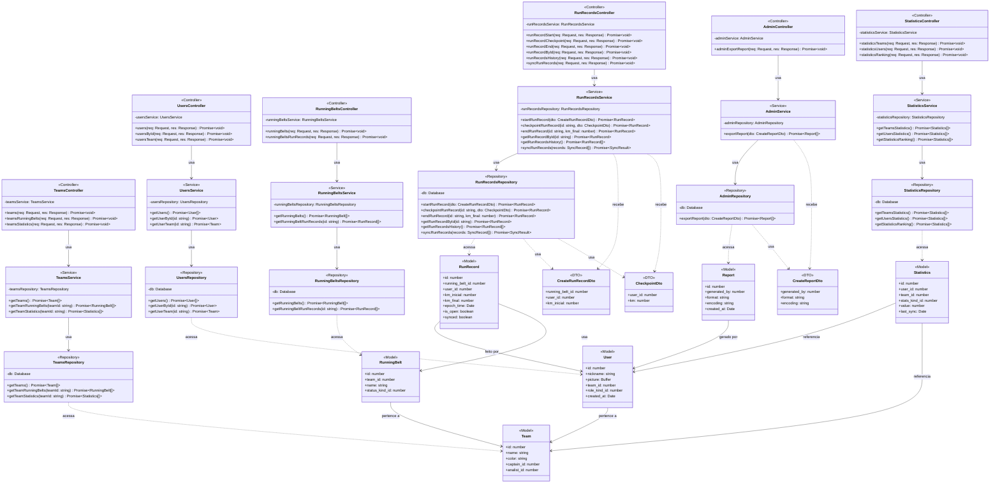

```mermaid
classDiagram

    class UsersController {
        <<Controller>>
        -usersService: UsersService
        +users(req: Request, res: Response) Promise~void~
        +usersById(req: Request, res: Response) Promise~void~
        +usersTeam(req: Request, res: Response) Promise~void~
    }
    class TeamsController {
        <<Controller>>
        -teamsService: TeamsService
        +teams(req: Request, res: Response) Promise~void~
        +teamsRunningBelts(req: Request, res: Response) Promise~void~
        +teamsStatistics(req: Request, res: Response) Promise~void~
    }
    class RunningBeltsController {
        <<Controller>>
        -runningBeltsService: RunningBeltsService
        +runningBelts(req: Request, res: Response) Promise~void~
        +runningBeltsRunRecords(req: Request, res: Response) Promise~void~
    }
    class RunRecordsController {
        <<Controller>>
        -runRecordsService: RunRecordsService
        +runRecordStart(req: Request, res: Response) Promise~void~
        +runRecordCheckpoint(req: Request, res: Response) Promise~void~
        +runRecordEnd(req: Request, res: Response) Promise~void~
        +runRecordById(req: Request, res: Response) Promise~void~
        +runRecordsHistory(req: Request, res: Response) Promise~void~
        +syncRunRecords(req: Request, res: Response) Promise~void~
    }
    class StatisticsController {
        <<Controller>>
        -statisticsService: StatisticsService
        +statisticsTeams(req: Request, res: Response) Promise~void~
        +statisticsUsers(req: Request, res: Response) Promise~void~
        +statisticsRanking(req: Request, res: Response) Promise~void~
    }
    class AdminController {
        <<Controller>>
        -adminService: AdminService
        +adminExportReport(req: Request, res: Response) Promise~void~
    }

    class UsersService {
        <<Service>>
        -usersRepository: UsersRepository
        +getUsers() Promise~User[]~
        +getUserById(id: string) Promise~User~
        +getUserTeam(id: string) Promise~Team~
    }
    class TeamsService {
        <<Service>>
        -teamsRepository: TeamsRepository
        +getTeams() Promise~Team[]~
        +getTeamRunningBelts(teamId: string) Promise~RunningBelt[]~
        +getTeamStatistics(teamId: string) Promise~Statistics[]~
    }
    class RunningBeltsService {
        <<Service>>
        -runningBeltsRepository: RunningBeltsRepository
        +getRunningBelts() Promise~RunningBelt[]~
        +getRunningBeltRunRecords(id: string) Promise~RunRecord[]~
    }
    class RunRecordsService {
        <<Service>>
        -runRecordsRepository: RunRecordsRepository
        +startRunRecord(dto: CreateRunRecordDto) Promise~RunRecord~
        +checkpointRunRecord(id: string, dto: CheckpointDto) Promise~RunRecord~
        +endRunRecord(id: string, km_final: number) Promise~RunRecord~
        +getRunRecordById(id: string) Promise~RunRecord~
        +getRunRecordsHistory() Promise~RunRecord[]~
        +syncRunRecords(records: SyncRecord[]) Promise~SyncResult~
    }
    class StatisticsService {
        <<Service>>
        -statisticsRepository: StatisticsRepository
        +getTeamsStatistics() Promise~Statistics[]~
        +getUsersStatistics() Promise~Statistics[]~
        +getStatisticsRanking() Promise~Statistics[]~
    }
    class AdminService {
        <<Service>>
        -adminRepository: AdminRepository
        +exportReport(dto: CreateReportDto) Promise~Report[]~
    }

    class CreateRunRecordDto {
        <<DTO>>
        +running_belt_id: number
        +user_id: number
        +km_inicial: number
    }
    class CheckpointDto {
        <<DTO>>
        +user_id: number
        +km: number
    }
    class CreateReportDto {
        <<DTO>>
        +generated_by: number
        +format: string
        +encoding: string
    }

    class UsersRepository {
        <<Repository>>
        -db: Database
        +getUsers() Promise~User[]~
        +getUserById(id: string) Promise~User~
        +getUserTeam(id: string) Promise~Team~
    }
    class TeamsRepository {
        <<Repository>>
        -db: Database
        +getTeams() Promise~Team[]~
        +getTeamRunningBelts(teamId: string) Promise~RunningBelt[]~
        +getTeamStatistics(teamId: string) Promise~Statistics[]~
    }
    class RunningBeltsRepository {
        <<Repository>>
        -db: Database
        +getRunningBelts() Promise~RunningBelt[]~
        +getRunningBeltRunRecords(id: string) Promise~RunRecord[]~
    }
    class RunRecordsRepository {
        <<Repository>>
        -db: Database
        +startRunRecord(dto: CreateRunRecordDto) Promise~RunRecord~
        +checkpointRunRecord(id: string, dto: CheckpointDto) Promise~RunRecord~
        +endRunRecord(id: string, km_final: number) Promise~RunRecord~
        +getRunRecordById(id: string) Promise~RunRecord~
        +getRunRecordsHistory() Promise~RunRecord[]~
        +syncRunRecords(records: SyncRecord[]) Promise~SyncResult~
    }
    class StatisticsRepository {
        <<Repository>>
        -db: Database
        +getTeamsStatistics() Promise~Statistics[]~
        +getUsersStatistics() Promise~Statistics[]~
        +getStatisticsRanking() Promise~Statistics[]~
    }
    class AdminRepository {
        <<Repository>>
        -db: Database
        +exportReport(dto: CreateReportDto) Promise~Report[]~
    }

    class User {
        <<Model>>
        +id: number
        +nickname: string
        +picture: Buffer
        +team_id: number
        +role_kind_id: number
        +created_at: Date
    }
    class Team {
        <<Model>>
        +id: number
        +name: string
        +color: string
        +captain_id: number
        +analist_id: number
    }
    class RunningBelt {
        <<Model>>
        +id: number
        +team_id: number
        +name: string
        +status_kind_id: number
    }
    class RunRecord {
        <<Model>>
        +id: number
        +running_belt_id: number
        +user_id: number
        +km_inicial: number
        +km_final: number
        +epoch_time: Date
        +is_open: boolean
        +synced: boolean
    }
    class Statistics {
        <<Model>>
        +id: number
        +user_id: number
        +team_id: number
        +stats_kind_id: number
        +value: number
        +last_sync: Date
    }
    class Report {
        <<Model>>
        +id: number
        +generated_by: number
        +format: string
        +encoding: string
        +created_at: Date
    }

    UsersController --> UsersService : usa
    TeamsController --> TeamsService : usa
    RunningBeltsController --> RunningBeltsService : usa
    RunRecordsController --> RunRecordsService : usa
    StatisticsController --> StatisticsService : usa
    AdminController --> AdminService : usa

    UsersService --> UsersRepository : usa
    TeamsService --> TeamsRepository : usa
    RunningBeltsService --> RunningBeltsRepository : usa
    RunRecordsService --> RunRecordsRepository : usa
    StatisticsService --> StatisticsRepository : usa
    AdminService --> AdminRepository : usa

    UsersRepository ..> User : acessa
    TeamsRepository ..> Team : acessa
    RunningBeltsRepository ..> RunningBelt : acessa
    RunRecordsRepository ..> RunRecord : acessa
    StatisticsRepository ..> Statistics : acessa
    AdminRepository ..> Report : acessa

    RunRecordsService ..> CreateRunRecordDto : recebe
    RunRecordsService ..> CheckpointDto : recebe
    AdminService ..> CreateReportDto : recebe

    RunRecordsRepository ..> CreateRunRecordDto : usa
    RunRecordsRepository ..> CheckpointDto : usa
    AdminRepository ..> CreateReportDto : usa

    User --> Team : pertence a
    RunningBelt --> Team : pertence a
    RunRecord --> User : feito por
    RunRecord --> RunningBelt : usa
    Statistics --> User : referencia
    Statistics --> Team : referencia
    Report --> User : gerado por
```