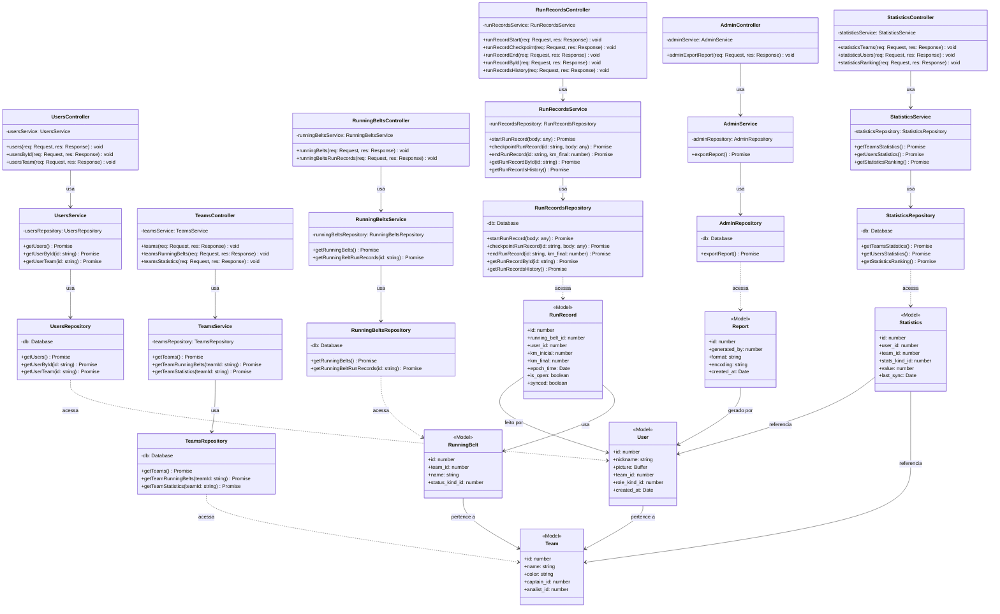

```mermaid
classDiagram

    class UsersController {
        -usersService: UsersService
        +users(req: Request, res: Response) void
        +usersById(req: Request, res: Response) void
        +usersTeam(req: Request, res: Response) void
    }
    class UsersService {
        -usersRepository: UsersRepository
        +getUsers() Promise
        +getUserById(id: string) Promise
        +getUserTeam(id: string) Promise
    }
    class UsersRepository {
        -db: Database
        +getUsers() Promise
        +getUserById(id: string) Promise
        +getUserTeam(id: string) Promise
    }
    class User {
        <<Model>>
        +id: number
        +nickname: string
        +picture: Buffer
        +team_id: number
        +role_kind_id: number
        +created_at: Date
    }

    class TeamsController {
        -teamsService: TeamsService
        +teams(req: Request, res: Response) void
        +teamsRunningBelts(req: Request, res: Response) void
        +teamsStatistics(req: Request, res: Response) void
    }
    class TeamsService {
        -teamsRepository: TeamsRepository
        +getTeams() Promise
        +getTeamRunningBelts(teamId: string) Promise
        +getTeamStatistics(teamId: string) Promise
    }
    class TeamsRepository {
        -db: Database
        +getTeams() Promise
        +getTeamRunningBelts(teamId: string) Promise
        +getTeamStatistics(teamId: string) Promise
    }
    class Team {
        <<Model>>
        +id: number
        +name: string
        +color: string
        +captain_id: number
        +analist_id: number
    }

    class RunningBeltsController {
        -runningBeltsService: RunningBeltsService
        +runningBelts(req: Request, res: Response) void
        +runningBeltsRunRecords(req: Request, res: Response) void
    }
    class RunningBeltsService {
        -runningBeltsRepository: RunningBeltsRepository
        +getRunningBelts() Promise
        +getRunningBeltRunRecords(id: string) Promise
    }
    class RunningBeltsRepository {
        -db: Database
        +getRunningBelts() Promise
        +getRunningBeltRunRecords(id: string) Promise
    }
    class RunningBelt {
        <<Model>>
        +id: number
        +team_id: number
        +name: string
        +status_kind_id: number
    }

    class RunRecordsController {
        -runRecordsService: RunRecordsService
        +runRecordStart(req: Request, res: Response) void
        +runRecordCheckpoint(req: Request, res: Response) void
        +runRecordEnd(req: Request, res: Response) void
        +runRecordById(req: Request, res: Response) void
        +runRecordsHistory(req: Request, res: Response) void
    }
    class RunRecordsService {
        -runRecordsRepository: RunRecordsRepository
        +startRunRecord(body: any) Promise
        +checkpointRunRecord(id: string, body: any) Promise
        +endRunRecord(id: string, km_final: number) Promise
        +getRunRecordById(id: string) Promise
        +getRunRecordsHistory() Promise
    }
    class RunRecordsRepository {
        -db: Database
        +startRunRecord(body: any) Promise
        +checkpointRunRecord(id: string, body: any) Promise
        +endRunRecord(id: string, km_final: number) Promise
        +getRunRecordById(id: string) Promise
        +getRunRecordsHistory() Promise
    }
    class RunRecord {
        <<Model>>
        +id: number
        +running_belt_id: number
        +user_id: number
        +km_inicial: number
        +km_final: number
        +epoch_time: Date
        +is_open: boolean
        +synced: boolean
    }

    class StatisticsController {
        -statisticsService: StatisticsService
        +statisticsTeams(req: Request, res: Response) void
        +statisticsUsers(req: Request, res: Response) void
        +statisticsRanking(req: Request, res: Response) void
    }
    class StatisticsService {
        -statisticsRepository: StatisticsRepository
        +getTeamsStatistics() Promise
        +getUsersStatistics() Promise
        +getStatisticsRanking() Promise
    }
    class StatisticsRepository {
        -db: Database
        +getTeamsStatistics() Promise
        +getUsersStatistics() Promise
        +getStatisticsRanking() Promise
    }
    class Statistics {
        <<Model>>
        +id: number
        +user_id: number
        +team_id: number
        +stats_kind_id: number
        +value: number
        +last_sync: Date
    }

    class AdminController {
        -adminService: AdminService
        +adminExportReport(req: Request, res: Response) void
    }
    class AdminService {
        -adminRepository: AdminRepository
        +exportReport() Promise
    }
    class AdminRepository {
        -db: Database
        +exportReport() Promise
    }
    class Report {
        <<Model>>
        +id: number
        +generated_by: number
        +format: string
        +encoding: string
        +created_at: Date
    }

    UsersController --> UsersService : usa
    UsersService --> UsersRepository : usa
    UsersRepository ..> User : acessa

    TeamsController --> TeamsService : usa
    TeamsService --> TeamsRepository : usa
    TeamsRepository ..> Team : acessa

    RunningBeltsController --> RunningBeltsService : usa
    RunningBeltsService --> RunningBeltsRepository : usa
    RunningBeltsRepository ..> RunningBelt : acessa

    RunRecordsController --> RunRecordsService : usa
    RunRecordsService --> RunRecordsRepository : usa
    RunRecordsRepository ..> RunRecord : acessa

    StatisticsController --> StatisticsService : usa
    StatisticsService --> StatisticsRepository : usa
    StatisticsRepository ..> Statistics : acessa

    AdminController --> AdminService : usa
    AdminService --> AdminRepository : usa
    AdminRepository ..> Report : acessa

    User --> Team : pertence a
    RunningBelt --> Team : pertence a
    RunRecord --> User : feito por
    RunRecord --> RunningBelt : usa
    Statistics --> User : referencia
    Statistics --> Team : referencia
    Report --> User : gerado por
```
