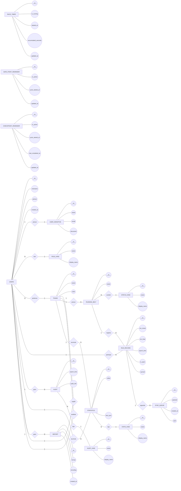

```mermaid
flowchart LR

USERS[USERS]
USER_SENSITIVE[USER_SENSITIVE]
ROLE_KIND[ROLE_KIND]
TEAMS[TEAMS]
RUNNING_BELT[RUNNING_BELT]
STATUS_KIND[STATUS_KIND]
RUN_RECORD[RUN_RECORD]
SYNC_QUEUE[SYNC_QUEUE]
AUDIT[AUDIT]
AUDIT_KIND[AUDIT_KIND]
STATISTICS[STATISTICS]
STATS_KIND[STATS_KIND]
REPORT[REPORT]
RACE_TIMER[RACE_TIMER]
SAFE_POINT_REMINDER[SAFE_POINT_REMINDER]
CHECKPOINT_REMINDER[CHECKPOINT_REMINDER]

USERS --- U_ID(("__id__"))
USERS --- U_NICK((nickname))
USERS --- U_PIC((picture))
USERS --- U_CREATED((created_at))

USER_SENSITIVE --- US_ID(("__id__"))
USER_SENSITIVE --- US_NAME((name))
USER_SENSITIVE --- US_EMAIL((email))
USER_SENSITIVE --- US_DOC((document))

ROLE_KIND --- RK_ID(("__id__"))
ROLE_KIND --- RK_NAME((name))
ROLE_KIND --- RK_DISPLAY((display_name))

TEAMS --- T_ID(("__id__"))
TEAMS --- T_NAME((name))
TEAMS --- T_COLOR((color))

RUNNING_BELT --- RB_ID(("__id__"))
RUNNING_BELT --- RB_NAME((name))

STATUS_KIND --- SK_ID(("__id__"))
STATUS_KIND --- SK_NAME((name))
STATUS_KIND --- SK_DISPLAY((display_name))

RUN_RECORD --- RR_ID(("__id__"))
RUN_RECORD --- RR_KMI((km_inicial))
RUN_RECORD --- RR_KMF((km_final))
RUN_RECORD --- RR_TIME((epoch_time))
RUN_RECORD --- RR_OPEN((is_open))
RUN_RECORD --- RR_SYNC((synced))

SYNC_QUEUE --- SQ_ID(("__id__"))
SYNC_QUEUE --- SQ_PAYLOAD((payload))
SYNC_QUEUE --- SQ_CREATED((created_at))
SYNC_QUEUE --- SQ_SENT((sent))

AUDIT --- A_ID(("__id__"))
AUDIT --- A_TIME((epoch_time))
AUDIT --- A_INFO((audit_info))

AUDIT_KIND --- AK_ID(("__id__"))
AUDIT_KIND --- AK_NAME((name))
AUDIT_KIND --- AK_DISPLAY((display_name))

STATISTICS --- ST_ID(("__id__"))
STATISTICS --- ST_VALUE((value))
STATISTICS --- ST_SYNC((last_sync))

STATS_KIND --- STK_ID(("__id__"))
STATS_KIND --- STK_NAME((name))
STATS_KIND --- STK_DISPLAY((display_name))

REPORT --- R_ID(("__id__"))
REPORT --- R_FORMAT((format))
REPORT --- R_ENCODING((encoding))
REPORT --- R_CREATED((created_at))

RACE_TIMER --- RT_ID(("__id__"))
RACE_TIMER --- RT_RUNNING((is_running))
RACE_TIMER --- RT_STARTED((started_at))
RACE_TIMER --- RT_ACC((accumulated_seconds))
RACE_TIMER --- RT_UPDATED((updated_at))

SAFE_POINT_REMINDER --- SPR_ID(("__id__"))
SAFE_POINT_REMINDER --- SPR_ACTIVE((is_active))
SAFE_POINT_REMINDER --- SPR_CYCLE((cycle_started_at))
SAFE_POINT_REMINDER --- SPR_UPDATED((updated_at))

CHECKPOINT_REMINDER --- CPR_ID(("__id__"))
CHECKPOINT_REMINDER --- CPR_ACTIVE((is_active))
CHECKPOINT_REMINDER --- CPR_CYCLE((cycle_started_at))
CHECKPOINT_REMINDER --- CPR_LAST((last_completed_at))
CHECKPOINT_REMINDER --- CPR_UPDATED((updated_at))

REL1{possui}
USERS ---|"1"| REL1
REL1 ---|"1"| USER_SENSITIVE

REL2{tem}
USERS ---|"N"| REL2
REL2 ---|"1"| ROLE_KIND

REL3{pertence}
USERS ---|"N"| REL3
REL3 ---|"1"| TEAMS

REL4a{capitã}
TEAMS ---|"1"| REL4a
REL4a ---|"1"| USERS

REL4b{analista}
TEAMS ---|"1"| REL4b
REL4b ---|"1"| USERS

REL5{possui}
TEAMS ---|"1"| REL5
REL5 ---|"N"| RUNNING_BELT

REL6{contém}
RUNNING_BELT ---|"N"| REL6
REL6 ---|"1"| STATUS_KIND

REL7{registra}
RUNNING_BELT ---|"1"| REL7
REL7 ---|"N"| RUN_RECORD

REL8{participa}
USERS ---|"1"| REL8
REL8 ---|"N"| RUN_RECORD

REL9{aguarda}
RUN_RECORD ---|"1"| REL9
REL9 ---|"N"| SYNC_QUEUE

REL10{gera}
USERS ---|"1"| REL10
REL10 ---|"N"| AUDIT

REL11{tipo}
AUDIT ---|"N"| REL11
REL11 ---|"1"| AUDIT_KIND

REL12{acumula}
USERS ---|"1"| REL12
REL12 ---|"N"| STATISTICS

REL13{acumula}
TEAMS ---|"1"| REL13
REL13 ---|"N"| STATISTICS

REL14{tipo}
STATISTICS ---|"N"| REL14
REL14 ---|"1"| STATS_KIND

REL15{gera}
USERS ---|"1"| REL15
REL15 ---|"N"| REPORT
```
