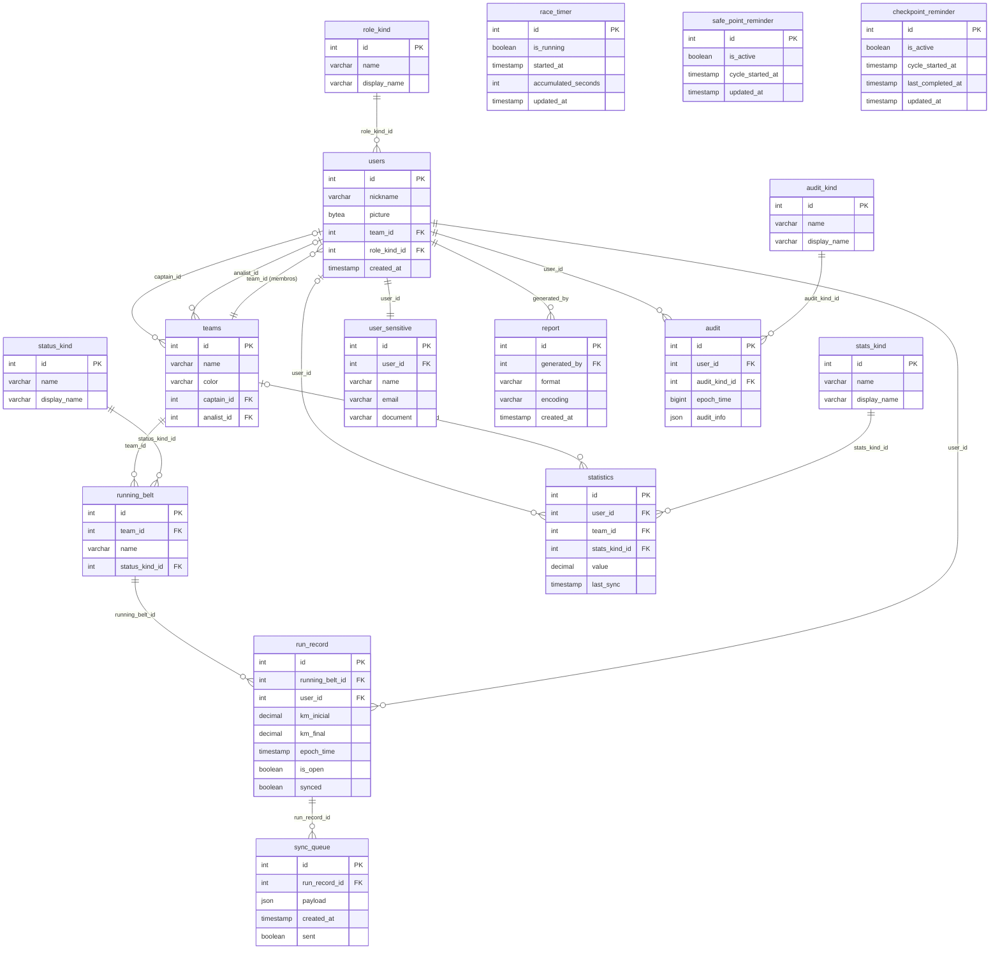

```mermaid
erDiagram
    role_kind {
        int id PK
        varchar name
        varchar display_name
    }

    status_kind {
        int id PK
        varchar name
        varchar display_name
    }

    audit_kind {
        int id PK
        varchar name
        varchar display_name
    }

    stats_kind {
        int id PK
        varchar name
        varchar display_name
    }

    teams {
        int id PK
        varchar name
        varchar color
        int captain_id FK
        int analist_id FK
    }

    users {
        int id PK
        varchar nickname
        bytea picture
        int team_id FK
        int role_kind_id FK
        timestamp created_at
    }

    user_sensitive {
        int id PK
        int user_id FK
        varchar name
        varchar email
        varchar document
    }

    report {
        int id PK
        int generated_by FK
        varchar format
        varchar encoding
        timestamp created_at
    }

    running_belt {
        int id PK
        int team_id FK
        varchar name
        int status_kind_id FK
    }

    run_record {
        int id PK
        int running_belt_id FK
        int user_id FK
        decimal km_inicial
        decimal km_final
        timestamp epoch_time
        boolean is_open
        boolean synced
    }

    sync_queue {
        int id PK
        int run_record_id FK
        json payload
        timestamp created_at
        boolean sent
    }

    audit {
        int id PK
        int user_id FK
        int audit_kind_id FK
        bigint epoch_time
        json audit_info
    }

    statistics {
        int id PK
        int user_id FK
        int team_id FK
        int stats_kind_id FK
        decimal value
        timestamp last_sync
    }

    race_timer {
        int id PK
        boolean is_running
        timestamp started_at
        int accumulated_seconds
        timestamp updated_at
    }

    safe_point_reminder {
        int id PK
        boolean is_active
        timestamp cycle_started_at
        timestamp updated_at
    }

    checkpoint_reminder {
        int id PK
        boolean is_active
        timestamp cycle_started_at
        timestamp last_completed_at
        timestamp updated_at
    }

    role_kind ||--o{ users : "role_kind_id"
    teams ||--o{ users : "team_id (membros)"
    users |o--o{ teams : "captain_id"
    users |o--o{ teams : "analist_id"
    users ||--|| user_sensitive : "user_id"
    users ||--o{ report : "generated_by"
    teams ||--o{ running_belt : "team_id"
    status_kind ||--o{ running_belt : "status_kind_id"
    running_belt ||--o{ run_record : "running_belt_id"
    users ||--o{ run_record : "user_id"
    run_record ||--o{ sync_queue : "run_record_id"
    users ||--o{ audit : "user_id"
    audit_kind ||--o{ audit : "audit_kind_id"
    users |o--o{ statistics : "user_id"
    teams |o--o{ statistics : "team_id"
    stats_kind ||--o{ statistics : "stats_kind_id"
```
