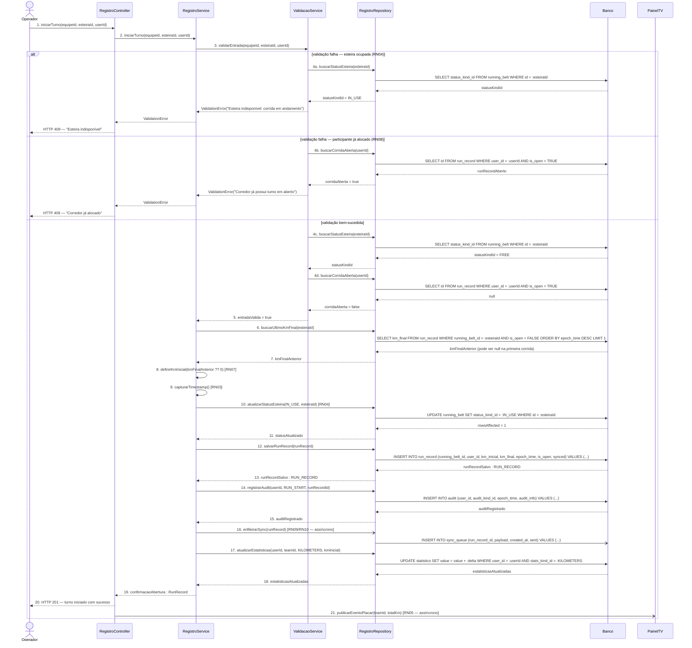

```mermaid
sequenceDiagram
    actor Operador
    participant RC as RegistroController
    participant RS as RegistroService
    participant VS as ValidacaoService
    participant RR as RegistroRepository
    participant DB as Banco

    Operador->>RC: 1. iniciarTurno(equipeId, esteiraId, userId)
    RC->>RS: 2. iniciarTurno(equipeId, esteiraId, userId)
    RS->>VS: 3. validarEntrada(equipeId, esteiraId, userId)

    alt validação falha — esteira ocupada (RN04)
        VS->>RR: 4a. buscarStatusEsteira(esteiraId)
        RR->>DB: SELECT status_kind_id FROM running_belt WHERE id = :esteiraId
        DB-->>RR: statusKindId
        RR-->>VS: statusKindId = IN_USE
        VS-->>RS: ValidationError("Esteira indisponível: corrida em andamento")
        RS-->>RC: ValidationError
        RC-->>Operador: HTTP 409 — "Esteira indisponível"
    else validação falha — participante já alocado (RN08)
        VS->>RR: 4b. buscarCorridaAberta(userId)
        RR->>DB: SELECT id FROM run_record WHERE user_id = :userId AND is_open = TRUE
        DB-->>RR: runRecordAberto
        RR-->>VS: corridaAberta = true
        VS-->>RS: ValidationError("Corredor já possui turno em aberto")
        RS-->>RC: ValidationError
        RC-->>Operador: HTTP 409 — "Corredor já alocado"
    else validação bem-sucedida
        VS->>RR: 4c. buscarStatusEsteira(esteiraId)
        RR->>DB: SELECT status_kind_id FROM running_belt WHERE id = :esteiraId
        DB-->>RR: statusKindId = FREE
        RR-->>VS: statusKindId
        VS->>RR: 4d. buscarCorridaAberta(userId)
        RR->>DB: SELECT id FROM run_record WHERE user_id = :userId AND is_open = TRUE
        DB-->>RR: null
        RR-->>VS: corridaAberta = false
        VS-->>RS: 5. entradaValida = true

        RS->>RR: 6. buscarUltimoKmFinal(esteiraId)
        RR->>DB: SELECT km_final FROM run_record WHERE running_belt_id = :esteiraId AND is_open = FALSE ORDER BY epoch_time DESC LIMIT 1
        DB-->>RR: kmFinalAnterior (pode ser null na primeira corrida)
        RR-->>RS: 7. kmFinalAnterior

        RS->>RS: 8. definirKmInicial(kmFinalAnterior ?? 0) [RN07]
        RS->>RS: 9. capturarTimestamp() [RN03]

        RS->>RR: 10. atualizarStatusEsteira(IN_USE, esteiraId) [RN04]
        RR->>DB: UPDATE running_belt SET status_kind_id = :IN_USE WHERE id = :esteiraId
        DB-->>RR: rowsAffected = 1
        RR-->>RS: 11. statusAtualizado

        RS->>RR: 12. salvarRunRecord(runRecord)
        RR->>DB: INSERT INTO run_record (running_belt_id, user_id, km_inicial, km_final, epoch_time, is_open, synced) VALUES (...)
        DB-->>RR: runRecordSalvo : RUN_RECORD
        RR-->>RS: 13. runRecordSalvo : RUN_RECORD

        RS->>RR: 14. registrarAudit(userId, RUN_START, runRecordId)
        RR->>DB: INSERT INTO audit (user_id, audit_kind_id, epoch_time, audit_info) VALUES (...)
        DB-->>RR: auditRegistrado
        RR-->>RS: 15. auditRegistrado

        RS-)RR: 16. enfileirarSync(runRecord) [RN09/RN10 — assíncrono]
        RR-)DB: INSERT INTO sync_queue (run_record_id, payload, created_at, sent) VALUES (...)

        RS->>RR: 17. atualizarEstatisticas(userId, teamId, KILOMETERS, kmInicial)
        RR->>DB: UPDATE statistics SET value = value + :delta WHERE user_id = :userId AND stats_kind_id = :KILOMETERS
        DB-->>RR: estatisticasAtualizadas
        RR-->>RS: 18. estatisticasAtualizadas

        RS-->>RC: 19. confirmacaoAbertura : RunRecord
        RC-->>Operador: 20. HTTP 201 — turno iniciado com sucesso

        RC-)PainelTV: 21. publicarEventoPlacar(teamId, totalKm) [RN05 — assíncrono]
    end
```