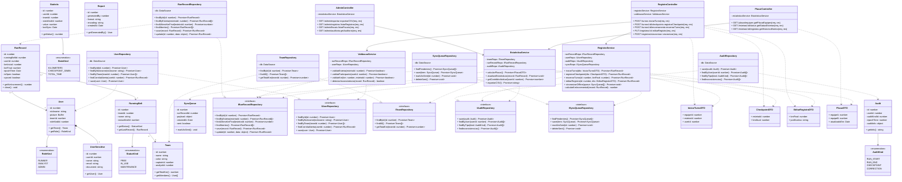

```mermaid
classDiagram

%% ====================== MODEL ======================

    class User {
        - id: number
        - nickname: string
        - picture: Buffer
        - teamId: number
        - roleKindId: number
        + getTeam() Team
        + getRole() RoleKind
    }

    class UserSensitive {
        - id: number
        - userId: number
        - name: string
        - email: string
        - document: string
        + getUser() User
    }

    class Team {
        - id: number
        - name: string
        - color: string
        - captainId: number
        - analystId: number
        + getTotalKm() number
        + getMembers() User[]
    }

    class RunningBelt {
        - id: number
        - teamId: number
        - name: string
        - statusKindId: number
        + getStatus() StatusKind
        + getLastRecord() RunRecord
    }

    class RunRecord {
        - id: number
        - runningBeltId: number
        - userId: number
        - kmInicial: number
        - kmFinal: number
        - epochTime: Date
        - isOpen: boolean
        - synced: boolean
        + getKmIncrement() number
        + close() void
    }

    class Audit {
        - id: number
        - userId: number
        - auditKindId: number
        - epochTime: number
        - auditInfo: object
        + getInfo() string
    }

    class SyncQueue {
        - id: number
        - runRecordId: number
        - payload: object
        - createdAt: Date
        - sent: boolean
        + markAsSent() void
    }

    class Statistic {
        - id: number
        - userId: number
        - teamId: number
        - statsKindId: number
        - value: number
        - lastSync: Date
        + getValue() number
    }

    class Report {
        - id: number
        - generatedBy: number
        - format: string
        - encoding: string
        - createdAt: Date
        + getGeneratedBy() User
    }

    class RoleKind {
        <<enumeration>>
        RUNNER
        ANALYST
        ADMIN
    }

    class StatusKind {
        <<enumeration>>
        FREE
        IN_USE
        MAINTENANCE
    }

    class AuditKind {
        <<enumeration>>
        RUN_START
        RUN_END
        CHECKPOINT
        CORRECTION
    }

    class StatsKind {
        <<enumeration>>
        KILOMETERS
        CHECKPOINT_30MIN
        TOTAL_TIME
    }

    User --> RoleKind
    User "1" *-- "1" UserSensitive
    RunningBelt --> StatusKind
    RunningBelt "2" --> "1" Team
    RunRecord "0..*" --> "1" User
    RunRecord "0..*" --> "1" RunningBelt
    Audit --> AuditKind
    Statistic --> StatsKind

%% ==================== REPOSITORY ====================

    class IRunRecordRepository {
        <<interface>>
        + findById(id: number) Promise~RunRecord~
        + findByEsteira(esteiraId: number) Promise~RunRecord[]~
        + findUltimoKmFinal(esteiraId: number) Promise~number~
        + findAbertos() Promise~RunRecord[]~
        + save(record: RunRecord) Promise~RunRecord~
        + update(id: number, data: object) Promise~RunRecord~
    }

    class IUserRepository {
        <<interface>>
        + findById(id: number) Promise~User~
        + findByNickname(nickname: string) Promise~User~
        + findByTeam(teamId: number) Promise~User[]~
        + findCorridaAberta(userId: number) Promise~RunRecord~
        + save(user: User) Promise~User~
    }

    class ITeamRepository {
        <<interface>>
        + findById(id: number) Promise~Team~
        + findAll() Promise~Team[]~
        + getTotalKm(teamId: number) Promise~number~
    }

    class IAuditRepository {
        <<interface>>
        + save(audit: Audit) Promise~Audit~
        + findByUser(userId: number) Promise~Audit[]~
        + findByTipo(kind: AuditKind) Promise~Audit[]~
        + findInconsistencias() Promise~Audit[]~
    }

    class ISyncQueueRepository {
        <<interface>>
        + findPendentes() Promise~SyncQueue[]~
        + save(item: SyncQueue) Promise~SyncQueue~
        + markAsSent(id: number) Promise~void~
        + deleteSent() Promise~void~
    }

    class RunRecordRepository {
        - db: DataSource
        + findById(id: number) Promise~RunRecord~
        + findByEsteira(esteiraId: number) Promise~RunRecord[]~
        + findUltimoKmFinal(esteiraId: number) Promise~number~
        + findAbertos() Promise~RunRecord[]~
        + save(record: RunRecord) Promise~RunRecord~
        + update(id: number, data: object) Promise~RunRecord~
    }

    class UserRepository {
        - db: DataSource
        + findById(id: number) Promise~User~
        + findByNickname(nickname: string) Promise~User~
        + findByTeam(teamId: number) Promise~User[]~
        + findCorridaAberta(userId: number) Promise~RunRecord~
        + save(user: User) Promise~User~
    }

    class TeamRepository {
        - db: DataSource
        + findById(id: number) Promise~Team~
        + findAll() Promise~Team[]~
        + getTotalKm(teamId: number) Promise~number~
    }

    class AuditRepository {
        - db: DataSource
        + save(audit: Audit) Promise~Audit~
        + findByUser(userId: number) Promise~Audit[]~
        + findByTipo(kind: AuditKind) Promise~Audit[]~
        + findInconsistencias() Promise~Audit[]~
    }

    class SyncQueueRepository {
        - db: DataSource
        + findPendentes() Promise~SyncQueue[]~
        + save(item: SyncQueue) Promise~SyncQueue~
        + markAsSent(id: number) Promise~void~
        + deleteSent() Promise~void~
    }

    RunRecordRepository ..|> IRunRecordRepository
    UserRepository ..|> IUserRepository
    TeamRepository ..|> ITeamRepository
    AuditRepository ..|> IAuditRepository
    SyncQueueRepository ..|> ISyncQueueRepository

    RunRecordRepository ..> RunRecord
    UserRepository ..> User
    TeamRepository ..> Team
    AuditRepository ..> Audit
    SyncQueueRepository ..> SyncQueue

%% ===================== SERVICE =====================

    class RegistroService {
        - runRecordRepo: IRunRecordRepository
        - userRepo: IUserRepository
        - auditRepo: IAuditRepository
        - syncRepo: ISyncQueueRepository
        + iniciarTurno(dto: IniciarTurnoDTO) Promise~RunRecord~
        + registrarCheckpoint(dto: CheckpointDTO) Promise~RunRecord~
        + encerrarTurno(id: number, kmFinal: number) Promise~RunRecord~
        + editarRegistro(id: number, dto: EditarRegistroDTO) Promise~RunRecord~
        + sincronizarOffline(queue: SyncQueue[]) Promise~void~
        - calcularKmIncremental(record: RunRecord) number
    }

    class ValidacaoService {
        - runRecordRepo: IRunRecordRepository
        - userRepo: IUserRepository
        + validarEsteira(esteiraId: number) Promise~boolean~
        + validarParticipante(userId: number) Promise~boolean~
        + validarKm(km: number, esteiraId: number) Promise~boolean~
        + detectarInconsistencia(record: RunRecord) boolean
    }

    class EstatisticaService {
        - teamRepo: ITeamRepository
        - runRecordRepo: IRunRecordRepository
        - auditRepo: IAuditRepository
        + calcularPlacar() Promise~PlacarDTO~
        + atualizarEstatisticas(record: RunRecord) Promise~void~
        + getContribIndividual(userId: number) Promise~number~
        + exportarCSV() Promise~string~
    }

    RegistroService ..> IRunRecordRepository
    RegistroService ..> IUserRepository
    RegistroService ..> IAuditRepository
    RegistroService ..> ISyncQueueRepository
    ValidacaoService ..> IRunRecordRepository
    ValidacaoService ..> IUserRepository
    EstatisticaService ..> ITeamRepository
    EstatisticaService ..> IRunRecordRepository
    EstatisticaService ..> IAuditRepository

%% ==================== CONTROLLER ===================

    class RegistroController {
        - registroService: RegistroService
        - validacaoService: ValidacaoService
        + POST /turnos iniciarTurno(req, res)
        + POST /turnos/:id/checkpoints registrarCheckpoint(req, res)
        + POST /turnos/:id/encerramento encerrarTurno(req, res)
        + PUT /registros/:id editarRegistro(req, res)
        + POST /registros/sincronizar sincronizar(req, res)
    }

    class AdminController {
        - estatisticaService: EstatisticaService
        + GET /admin/exportar exportarCSV(req, res)
        + GET /admin/registros listarRegistros(req, res)
        + GET /admin/fiscais listarFiscais(req, res)
        + GET /admin/auditoria getAuditoria(req, res)
    }

    class PlacarController {
        - estatisticaService: EstatisticaService
        + GET /placar/equipes getPlacarEquipes(req, res)
        + GET /esteiras/:id/status getStatusEsteiras(req, res)
        + GET /esteiras/:id/registros getHistoricoEsteira(req, res)
    }

    RegistroController --> RegistroService
    RegistroController --> ValidacaoService
    AdminController --> EstatisticaService
    PlacarController --> EstatisticaService

%% ==================== DTO ======================

    class IniciarTurnoDTO {
        + equipeId: number
        + esteiraId: number
        + userId: number
    }

    class CheckpointDTO {
        + esteiraId: number
        + kmAtual: number
    }

    class EditarRegistroDTO {
        + kmFinal: number
        + justificativa: string
    }

    class PlacarDTO {
        + equipeA: number
        + equipeB: number
        + atualizadoEm: Date
    }

    RegistroController ..> IniciarTurnoDTO
    RegistroController ..> CheckpointDTO
    RegistroController ..> EditarRegistroDTO
    PlacarController ..> PlacarDTO
    RegistroService ..> IniciarTurnoDTO
    RegistroService ..> CheckpointDTO
    RegistroService ..> EditarRegistroDTO
    EstatisticaService ..> PlacarDTO
```

